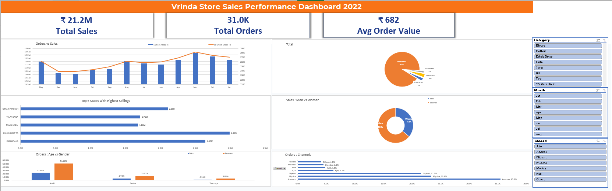
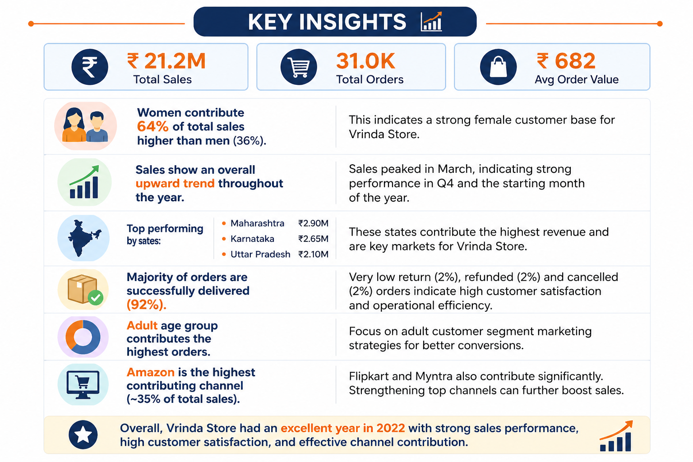

# 📊 Vrinda Store Sales Analysis (Excel Project)

## 📌 Project Overview  
This project analyzes Vrinda Store sales data (2022) using Microsoft Excel to uncover trends, customer behavior, and business insights.  
An interactive dashboard was created to visualize key metrics and support decision-making.

---

## 🛠️ Tools Used  
- Microsoft Excel  

---

## ⚙️ Project Workflow  

### 🔹 Data Cleaning  
- Used filters to validate data  
- Removed duplicates and ensured no null values  

### 🔹 Data Processing  
- Created Age Groups using IF formula (converted formulas to values)  
- Extracted Month using date/text formatting  
- Removed unnecessary grand totals  

### 🔹 Data Analysis  
- Built Pivot Tables for structured analysis  
- Created charts for:
  - Month vs Sales  
  - Men vs Women Sales  
  - Top 5 States by Sales  
  - Order Status  
  - Age Group vs Orders  

- Connected all charts using slicers for an interactive dashboard  

---

## 📊 Key Insights  
- 💰 Total Sales: ₹21.2M  
- 📦 Total Orders: 31K  
- 🛒 Average Order Value: ₹682  

- 👩 Women contribute ~64% of total sales  
- 📍 Top States: Maharashtra, Karnataka, Uttar Pradesh  
- 🛍 Top Channel: Amazon (~35%)  

- 🚚 ~92% orders successfully delivered  
- 🔁 Low return/cancellation rate (~2–3%)  

- 👨‍👩‍👧 Adult age group contributes the highest orders  

---

## 📷 Dashboard Preview  

<p align="center">
  
</p>

---

## 📷 Insights  

<p align="center">
  
</p>

---

## 📁 Project Structure  

```
Vrinda-Store-Sales-Analysis-Excel/
│
├── Vrinda_Store_Data.xlsx
├── dashboard.png
├── insights.png
└── README.md
```

---

## 📈 Conclusion  
Vrinda Store showed strong performance in 2022 with high sales and efficient order fulfillment.  
Women customers, top-performing states, and major platforms like Amazon were key contributors to revenue.

---

## 🚀 Key Learnings  
- Learned data cleaning and preprocessing  
- Built interactive dashboards using slicers  
- Gained hands-on experience with pivot tables and charts  
- Improved ability to extract business insights from data  

---

## 🔗 Connect with Me  
https://www.linkedin.com/in/nsr2k06/
